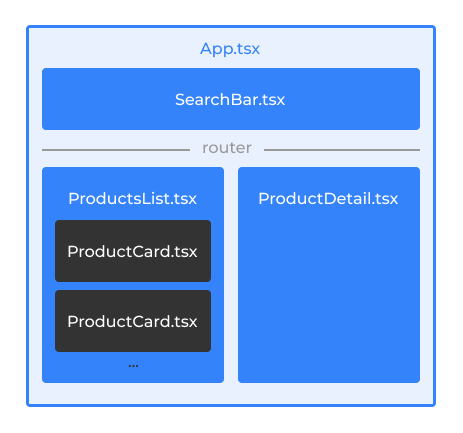
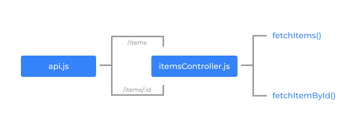

#Architecture

## Frontend

Simple architecture based on independant componets:

- `App` contains the `Searchbar` and the router switch between `ProductsList` or `ProductDetail` according to the url
- `ProductsList` renders as many `ProductCard` components as items returns the api

### Folder structure

    src
     └── assets           // images
     └── components
     │    └── Component   // independant components
     │    └── shared      // reusable components
     └── utils            // reusable functions
     └── App

---

## Server

- `api.js` calls methods from `itemsController` according to the url
- `itemsController` gets the raw data from the apis and gives it the right structure to deliver to the frontend

### Folder structure

    src
     └── bin              // config
     └── controllers      // handle data between api and routes
     └── routes           // assigns functionality according to urls
     └── app
